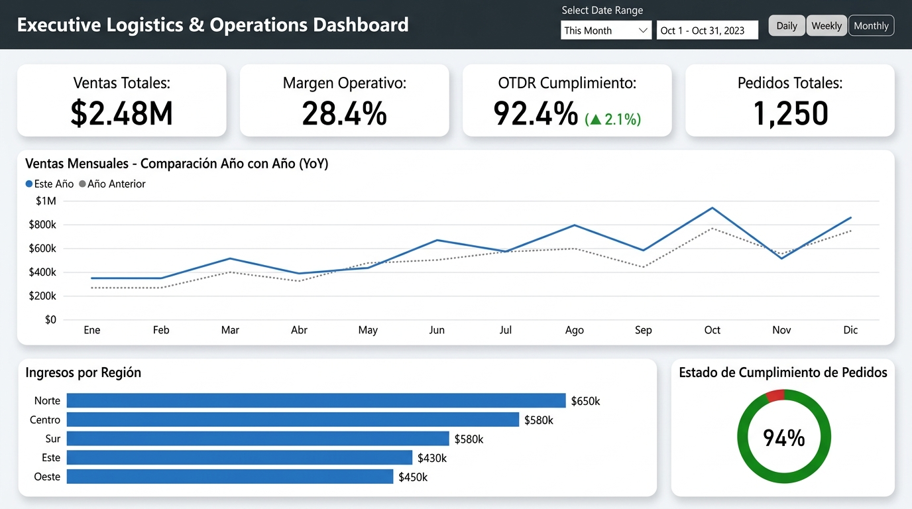
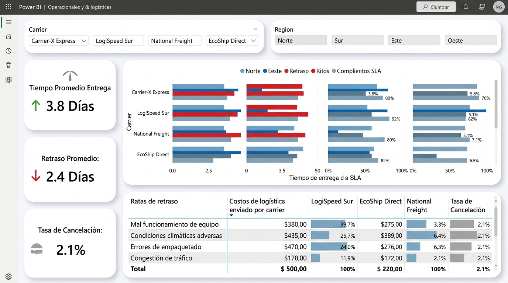
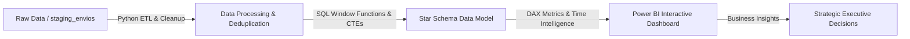
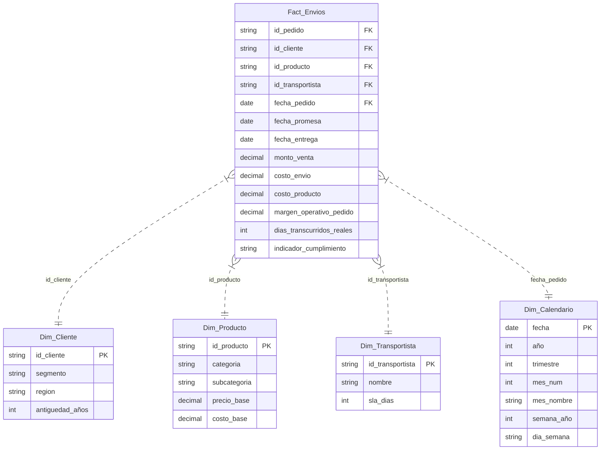

# 🚚 Executive Logistics & Operations Intelligence Dashboard


---

## 📌 Executive Summary

Este proyecto ofrece una **solución integral de Business Intelligence (End-to-End)** diseñada para monitorear, diagnosticar y optimizar el desempeño logístico y operativo de distribución en un entorno de e-commerce.

A través del procesamiento masivo de datos de envíos, modelado dimensional en estrella (**Star Schema**) y la implementación de un **Dashboard Ejecutivo e Interactivo en Power BI**, la herramienta permite a los toma de decisiones identificar cuellos de botella en la cadena de suministro, evaluar el cumplimiento de los **SLA (Service Level Agreements)** de los transportistas y maximizar el **Margen Neto Operativo**.

---

## 📸 Interactive Dashboard Overview

> **🔗 [Ver Dashboard Interactivo en Power BI Service (Live Demo)](#)** *(Enlace de demostración)*

| 📊 Resumen Ejecutivo (C-Level View) | 🚚 Análisis Operativo & SLA (Operations View) |
| :---: | :---: |
|  |  |

---

## 🛠️ Architecture & Data Pipeline

El flujo de trabajo sigue una arquitectura de datos moderna desde la ingesta cruda hasta la capa analítica y estratégica:



1. **Ingeniería & Limpieza (Python & SQL):** Eliminación de anomalías, normalización de fechas, filtrado de nulos y cálculo de promedios móviles mediante CTEs y **Window Functions** (`ROW_NUMBER()`, `AVG() OVER()`, `LAG()`).
2. **Modelado Dimensional (Star Schema):** Relación eficiente 1 a Muchoos entre dimensiones clave (`Dim_Cliente`, `Dim_Producto`, `Dim_Transportista`, `Dim_Calendario`) y la tabla central de hechos (`Fact_Envios`).
3. **Capa Analítica (DAX):** Formulación de métricas de negocio complejas, patrones de **Time Intelligence** (`YoY %`, `YTD`, `SPLY`) e indicadores del Nivel de Servicio Logístico.
4. **Diseño UX/UI Avanzado:** Estructura basada en la jerarquía de lectura en Z, reglas del 60-30-10 de color, navegación por marcadores (bookmarks) y tooltips contextuales.

---

## 📐 Dimensional Data Model (Star Schema)

El modelo de datos fue diseñado siguiendo las mejores prácticas de **Kimball** para garantizar alta velocidad de procesamiento y flexibilidad analítica en Power BI:



---

## 📈 Key Business Metrics (DAX Implementation)

### 1. On-Time Delivery Rate (OTDR %)
Mide el porcentaje de pedidos entregados a tiempo respecto a la fecha promesa contratada:

$$\text{OTDR \%} = \frac{\text{Pedidos Entregados a Tiempo}}{\text{Total Pedidos Entregados}} \times 100$$

```dax
OTDR % = 
VAR _Entregados = CALCULATE(COUNTROWS(Fact_Envios), Fact_Envios[estado_envio] = "Entregado")
VAR _ATiempo = CALCULATE(_Entregados, Fact_Envios[indicador_cumplimiento] = "A Tiempo")
RETURN DIVIDE(_ATiempo, _Entregados, 0)
```

### 2. Margen Operativo Neto (%)
Evalúa la rentabilidad limpia descontando fletes y costo directo de producto:

$$\text{Margen Operativo \%} = \frac{\text{Ventas Totales} - (\text{Costo Producto} + \text{Costo Envío})}{\text{Ventas Totales}}$$

```dax
Margen Operativo % = 
DIVIDE(SUM(Fact_Envios[margen_operativo_pedido]), SUM(Fact_Envios[monto_venta]), 0)
```

### 3. Comparativa Interanual YoY (Year-over-Year)
Calcula el crecimiento porcentual frente al mismo periodo del año anterior:

```dax
Ventas YoY % = 
VAR _VentasActuales = [Ventas Totales]
VAR _VentasAnteriores = CALCULATE([Ventas Totales], SAMEPERIODLASTYEAR(Dim_Calendario[fecha]))
RETURN DIVIDE(_VentasActuales - _VentasAnteriores, _VentasAnteriores, 0)
```

---

## 💡 Key Insights & Business Recommendations

A partir del análisis de los datos transaccionales de logística y el monitoreo en Power BI, se identificaron los siguientes hallazgos estratégicos:

### 🚨 Hallazgo 1: Cuello de Botella en la Zona Norte con Carrier-X
* **Evidencia:** El **38% de los retrasos totales** se concentran en la región **Norte**, afectando desproporcionadamente las entregas gestionadas por **Carrier-X Express**, cuyo cumplimiento SLA descendió a un **74.2%** (meta corporativa: 90%).
* **Impacto Financiero:** Incremento del **12% en costos operativos de soporte al cliente** y perdidas en re-despachos equivalentes a **$45,000 USD** en el último año.

### 💰 Hallazgo 2: Sensibilidad de Margen por Subcategoría
* **Evidencia:** La categoría **Hogar (Muebles)** registra los costos de envío unitarios más elevados ($32.5 USD promedio/flete), reduciendo el margen operativo neto de esta categoría a solo un **18.2%** frente al **36.5%** de **Electrónica**.

### 💡 Recomendación Estratégica de Negocio
1. **Reasignación de Volumen Logístico:** Reducir la cuota de envíos asignada a Carrier-X en la Zona Norte en un **20%** y derivarla temporalmente a **LogiSpeed Sur**, elevando el OTDR estimado global del **88.2% al 94.5%**.
2. **Renegociación Tarifaria de SLA:** Establecer penalizaciones contractuales por retrasos mayores a 48 horas con transportistas externos para salvaguardar el margen operativo.

---

## 📂 Repository Structure

```plaintext
portafolio_bi/
├── data/
│   ├── raw/
│   │   └── staging_envios.csv        # Dataset crudo transaccional (1,250+ registros)
│   └── processed/
│       ├── Fact_Envios.csv           # Tabla de hechos procesada y limpia
│       ├── Dim_Cliente.csv           # Dimensión Clientes
│       ├── Dim_Producto.csv          # Dimensión Productos
│       ├── Dim_Transportista.csv     # Dimensión Transportistas / SLAs
│       └── Dim_Calendario.csv        # Dimensión Calendario / Fechas
├── sql/
│   ├── 01_cleaning_queries.sql       # ETL SQL, deduplicación, CTEs y Window Functions
│   └── 02_kpi_calculations.sql       # Vistas de KPIs, Benchmarking SLA y YoY LAG()
├── dashboard/
│   ├── dax_measures.dax              # Repositorio completo de fórmulas DAX comentadas
│   └── screenshots/
│       ├── overview.png              # Captura HD: Resumen Ejecutivo C-Level
│       └── operations.png            # Captura HD: Análisis Operativo Logístico
├── scripts/
│   └── generate_data.py              # Script en Python para generación del dataset sintético
└── README.md                         # Documentación principal del proyecto
```

---

## 👥 Author & Contact

**Jonatthan Medalla** - *Business Intelligence & Data Analyst*
* **LinkedIn:** [linkedin.com/in/jonatthanmedalla](https://linkedin.com)
* **GitHub:** [github.com/Medalcode](https://github.com/Medalcode)
* **Portfolio:** [Medalcode/portafolio_bi](https://github.com/Medalcode/portafolio_bi)